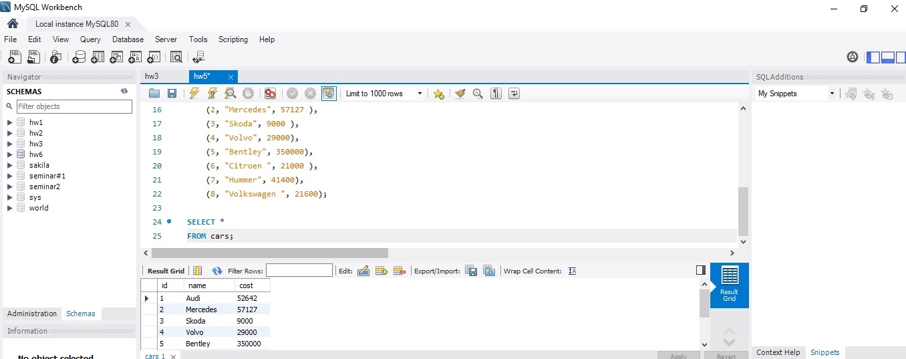
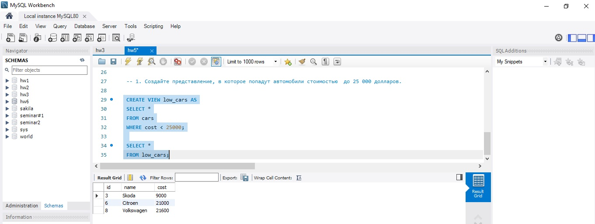
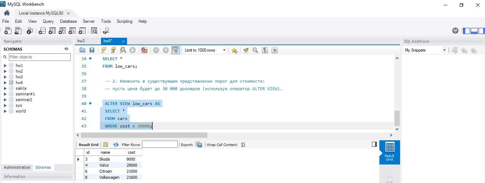
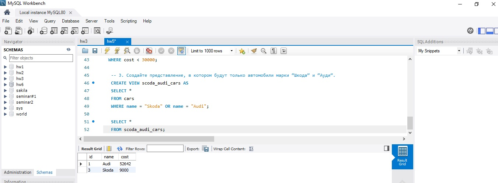
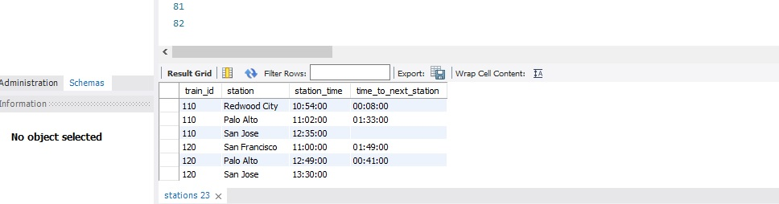
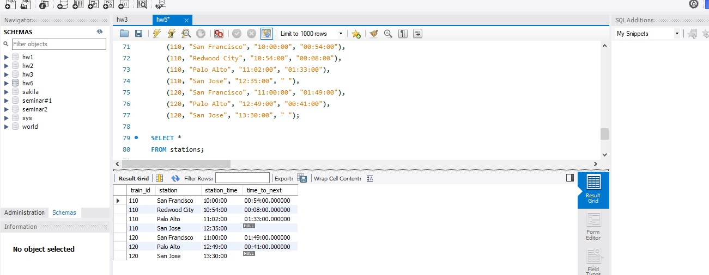

### Создание таблицы.
 
DROP DATABASE IF EXISTS hw5;\
CREATE DATABASE IF NOT EXISTS hw5;\
USE hw5;

CREATE TABLE cars\
(\
	id INT NOT NULL PRIMARY KEY,\
    name VARCHAR(45),\
    cost INT\
);

INSERT cars\
VALUES\
	(1, "Audi", 52642),\
    (2, "Mercedes", 57127),\
    (3, "Skoda", 9000 ),\
    (4, "Volvo", 29000),\
	(5, "Bentley", 350000),\
    (6, "Citroen ", 21000), \
    (7, "Hummer", 41400), \
    (8, "Volkswagen ", 21600);\
    
SELECT *\
FROM cars;

### 1. Создайте представление, в которое попадут автомобили стоимостью  до 25 000 долларов.
 
 CREATE VIEW low_cars AS\
 SELECT *\
 FROM cars\
 WHERE cost < 25000;
 
 SELECT *\
 FROM low_cars;

 
 
### 2. Изменить в существующем представлении порог для стоимости: 
### пусть цена будет до 30 000 долларов (используя оператор ALTER VIEW).
  
  ALTER VIEW low_cars AS\
  SELECT *\
  FROM cars\
  WHERE cost < 30000;

  
  
### 3. Создайте представление, в котором будут только автомобили марки “Шкода” и “Ауди”.

   CREATE VIEW scoda_audi_cars AS\
   SELECT *\
   FROM cars\
   WHERE name = "Skoda" OR name = "Audi";
   
   SELECT *\
   FROM scoda_audi_cars;

   
   
### 4. Добавьте новый столбец под названием «время до следующей станции». 
### Чтобы получить это значение, мы вычитаем время станций для пар смежных станций. 
### Мы можем вычислить это значение без использования оконной функции SQL, но это может быть очень сложно. 
### Проще это сделать с помощью оконной функции LEAD . 
### Эта функция сравнивает значения из одной строки со следующей строкой, чтобы получить результат. 
### В этом случае функция сравнивает значения в столбце «время» для станции со станцией сразу после нее.
    
    CREATE TABLE stations\
(\
	train_id INT,\
    station VARCHAR(45),\
    station_time VARCHAR(45),\
    time_to_next_station VARCHAR(45)\
);

INSERT stations\
VALUES\
	(110, "San Francisco", "10:00:00", "00:54:00"),\
    (110, "Redwood City", "10:54:00", "00:08:00"),\
    (110, "Palo Alto", "11:02:00", "01:33:00"),\
    (110, "San Jose", "12:35:00", " "),\
	(120, "San Francisco", "11:00:00", "01:49:00"),\
    (120, "Palo Alto", "12:49:00", "00:41:00"),\
    (120, "San Jose", "13:30:00", " ");
    
SELECT *\
FROM stations;

SELECT\
	train_id,\
    station,\
    station_time,\
    timediff(LEAD(station_time, 1)OVER(PARTITION BY train_id ORDER BY station_time ), station_time) AS\ time_to_next\
    FROM stations;

    